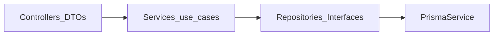

# Aerobi API — guia para agentes (IA)

Fonte canónica de contexto para qualquer modelo (Claude, Codex, Cursor, Copilot) a trabalhar neste repositório. Documenta apenas o que **não se deduz só pelo código**: produto, stack, convenções estáveis e onde procurar o resto.

## Produto

API **Aerobi** (NestJS): sincronização e consulta relacionadas com dados ANAC (ex. histórico RAB em CSV), aeródromos (públicos/privados, operacionais), proxies **Plugfield** e **AISWEB/DECEA**, consulta à ANAC para licença de piloto, pedidos de aterragem, visitas técnicas, tokens de e‑mail/password, etc.

Operação (`X-API-Key`, variáveis `PLUGFIELD_*`, `AISWEB_*`, Docker, cron RAB): ver [README.md](README.md).

## Stack canónica

- **Framework**: NestJS 11
- **Runtime**: Node 22 (CI em `ubuntu-latest`; ver [`.github/workflows/ci.yml`](.github/workflows/ci.yml))
- **Package manager**: npm (`package-lock.json` é fonte de verdade)
- **ORM / DB**: Prisma 7 (`@prisma/adapter-pg`) + PostgreSQL — schema em `prisma/schema.prisma`, cliente gerado sob `src/generated/prisma/` (via `postinstall` / `prisma generate`)
- **Validação / transformação**: class-validator + class-transformer nos DTOs de entrada quando aplicável (`ValidationPipe` global com `transform` + `whitelist` em `src/main.ts`)
- **Documentação HTTP**: Swagger em `/api/docs` (`@nestjs/swagger`)
- **Testes**: Jest — ficheiros `*.spec.ts` junto ao código (ou em `src/`)
- **CI/CD**: [`.github/workflows/ci.yml`](.github/workflows/ci.yml) (security audit, Quality: prisma generate + validate + `lint:check` + `format:check` + build, job Test com Postgres + migrates + test); [`.github/workflows/release.yml`](.github/workflows/release.yml) para `main` (semantic-release, imagem GHCR, deploy)
- **Path alias**: `@/*` → `src/*` (`tsconfig.json` / `jest`)

### Portas (desenvolvimento típico)

- API dev: **3333** (ver README / Docker Compose)

## Arquitectura e pastas

| Área | Papel |
|------|--------|
| `src/common/` | Guards (`AerobiApiKeyGuard`), filtros (`AllExceptionsFilter`), excepções (`CustomHttpException`), enumerados de erro (`ErrorCode`), mensagens (`ErrorMessageModule` / serviços), utilitários partilhados |
| `src/modules/<domínio>/` | Módulos de feature Nest (controllers, services, DTOs, repositórios, mappers, docs Swagger, cron quando aplicável) |
| `src/prisma/` | `PrismaModule` + `PrismaService` injectável |
| `src/app.module.ts` | Registo de todos os feature modules |

### Exemplos de referência por forma de módulo

- **CRUD HTTP alinhado com scaffold**: `src/modules/rab/`, `src/modules/public-aerodromes/` (estrutura com controllers/services/repositories/docs/mappers onde aplicável).
- **Integração / proxy**: `src/modules/plugfield/`, `src/modules/aisweb/`.
- **Sync / ingestão**: `src/modules/private-aerodromes/`.
- **Agendamento**: `src/modules/scheduler/`.

Pastas‑guia dentro de vários feature modules incluem `README.md` por camada (`controllers/`, `services/`, …).

## Baixo acoplamento e divisão de responsabilidades

- **Controller**: HTTP/Swagger + validação de I/O via DTOs; delega sempre que possível ao service.
- **Service**: caso de uso e orquestração; não “conhece” detalhes de framework além do que for necessário.
- **Repository** (+ interface onde existir): acesso ao Prisma; evitar duplicar queries espalhadas em vários services.
- **DTOs**: nos limites das rotas; **mappers** para projectar entidades/registos em resposta API onde o projeto usa esse padrão.
- Entre domínios: preferir **`imports` / `exports` de `Module`** e serviços públicos aos imports directos ao interior de outro módulo. Lógica partilhada transversal vai para `src/common/` ou um módulo dedicado exportado explicitamente.
- Evitar “serviço deus”; manter comandos/consultas coerentes dentro do respetivo módulo.

## Erros HTTP

Lançar **`CustomHttpException`** com **`ErrorCode`** estável (`src/common/enums/error-code.enum.ts`) e mensagens via **`ErrorMessageService.getMessage(...)`**. O **`AllExceptionsFilter`** garante payloads consistentes. Não regressar para strings hardcoded em `HttpException('...')` em fluxos novos.

## Autenticação do cliente para a Aerobi

Rotas sensíveis usam comunmente **`@UseGuards(AerobiApiKeyGuard)`** e header **`X-API-Key`** (= `AEROBI_API_KEY`). Em **`NODE_ENV=development`**, há bypass salvo quando **`AEROBI_REQUIRE_AUTH=true`**. Produção obriga API key onde o guard estiver aplicado. Detalhes: README + Swagger + JSDoc do guard.

## Usuários e autenticação interna (Aerobi)

Camada de autenticação **humana** (login de usuário no painel) — convive com o `AerobiApiKeyGuard` (que continua para clientes externos por header `X-API-Key`).

- **Schema (Prisma)**: models `User`, `RefreshToken` e enum `UserRole` em `prisma/schema.prisma` (final do ficheiro). `Token` ganhou FK opcional `user_id` (usada por INVITE/EMAIL_VERIFICATION/PASSWORD_RESET; `subject_id` continua para OTP/GENERIC).
- **Roles** (`UserRole`): `ADMIN | COORDINATOR | OPERATOR | TECHNICAL` — espelha exatamente as roles já gateadas pelo `aerobi-web`. ADMIN é o único que pode criar/remover usuários e alterar roles.
- **Onboarding por convite (sem signup público)**: ADMIN cria `User` com `password=null` + Token tipo `INVITE` (módulo `tokens`); o convidado recebe email com link `${FRONTEND_URL}/accept-invite?token=...`, define a própria senha e o email é marcado como verificado automaticamente. Não existe rota pública de signup.
- **Bootstrap de usuários**: sem signup, o único caminho para destravar o sistema é o orquestrador de seeds em `scripts/seeds/`. Runners: **`admin`** (conta ADMIN global, envs `SEED_ADMIN_EMAIL`/`SEED_ADMIN_PASSWORD`/`SEED_ADMIN_NAME`), **`contact`** (exemplos do formulário Fale Conosco — sempre incluído no seed completo) e **`states`** (por UF cria o grupo `Grupo <Estado>`, sobe a **bandeira** do estado como imagem do grupo — PNGs versionados em `scripts/seeds/assets/flags/`, upload via `S3Client` leve nas envs `MINIO_*` — e cria N usuários por função: `SEED_DEFAULT_PASSWORD`, `SEED_EMAIL_DOMAIN` default `aerobi.com.br`, `SEED_{COORDINATORS,OPERATORS,TECHNICALS}_PER_STATE` default 1). Emails inglês/role `coordinator_<uf>@`, `operator_<uf>@`, `technical_<uf>@` (1º sem sufixo, `_n` do 2º em diante). Rode `npm run seed` (todos) ou granular `seed:admin`/`seed:states`. **Idempotente e create-only**: se o usuário/grupo/imagem/contact já existe é no-op — `RUN_SEEDS_ON_BOOT=true` não reseta senha/role (issue #227). `RUN_SEEDS_ON_BOOT` controla o seed automático após `prisma migrate deploy`: **default `true` em dev** (start-dev.sh, ts-node), **default `false` em prod** (start-prod.sh, `node dist/scripts/run-seeds.js` — JS compilado, já que `npm ci --omit=dev` remove ts-node). As bandeiras são copiadas para `dist/scripts/seeds/assets` no `Dockerfile` (o `nest build` não copia não-`.ts`).
- **Adicionando novos seeds**: criar `scripts/seeds/<nome>.seed.ts` exportando um `SeedRunner` (`{ name, run }`) e adicionar ao array em `scripts/seeds/index.ts` (ordem importa). Helpers reutilizáveis em `scripts/seeds/lib/` (`env`, `password`, `storage`, `groups`, `users`, `contacts`, `group-image`, `flags`); dados estáveis em `scripts/seeds/data/`. A função `run` recebe `{ prisma, logger, env }` e **deve ser idempotente** (preferir create-only / upsert / skipDuplicates).
- **Módulos `auth/` e `users/`** (login/refresh/me/logout; CRUD de usuários, convite, password-reset): **já implementados** e registados em [`src/app.module.ts`](src/app.module.ts). Seguem o padrão de um controller/service por ação (ver `src/modules/auth/controllers/` e `src/modules/users/controllers/`). A fundação original (schema + ErrorCodes + templates de email + seed) continua descrita acima.
- **Campos legados com Firebase uid** (`LandingRequest.reviewed_by`, `TechnicalVisit.visit_by`, auditoria `created_by`/`updated_by`/`deleted_by`, `Token.subject_id`): permanecem como `String` por ora. Migração para FK ao `users.id` ficará em PR/issue separada.

## Armazenamento de arquivos (MinIO/S3)

Object storage por entidade segue um **padrão único** — passo-a-passo em [`src/modules/storage/README.md`](src/modules/storage/README.md) (**fonte canônica**). O que não se deduz do código:

- **Ambiente = bucket** (`aerobi-{dev,staging,prod}`), um bucket por app (outras apps: `<app>-<env>`). A key **espelha o banco**: `{entidade}/{itemId}/{docType}/{fileId}[-{slug}].{ext}` — topo = a tabela **dona** do arquivo (coleção usa a entidade-raiz, nunca a avó), `docType` snake_case sempre presente, `fileId` uuid opaco (nome original vai em metadado, não na key).
- **Guardar a KEY** no banco (`*_key @db.Text`), **nunca a URL**; o DTO expõe `*Url` **presigned** (TTL 1h) resolvido on-read via `resolveBestEffortPresignedUrl`. Buckets **privados**; **só a API escreve** (multipart → controller com Multer memory → `StorageService`; clientes nunca escrevem direto).
- Montar a key **sempre** via `buildStorageKey` (`src/modules/storage/keys/`) — `entidade`/`docType` tipados (`StorageDomain`/`STORAGE_DOC_TYPES`; registre tipos novos lá). Config de bucket/region compartilhada em `src/modules/storage/storage.config.ts` (app + seeds). Provisionamento: `aerobi-ansible` (`roles/minio`) + `aerobi-local-infra`.
- Moldes: `groups` (coleção 1-imagem-ativa via tabela `GroupImage` + `*_key` desnormalizado) e `movements` (1:1 na linha, id pré-gerado no service). Skill de orientação: [`.claude/skills/storage/`](.claude/skills/storage/).

## Auditoria (audit log)

Trilha **append-only** das mutações do domínio — módulo `audit` (execução #367 da epic #353), fonte canônica em [`src/modules/audit/README.md`](src/modules/audit/README.md). O que não se deduz do código:

- **Escrita interna, best-effort**: cada mutação chama `AuditRecorderService.record(input, context)` (não há rota HTTP de gravação — evita falsificar a trilha). A gravação **nunca** derruba a operação de negócio (falha é logada e engolida).
- **Padrão de instrumentação** (implementado em `groups` e `users`, replicar nos próximos): módulo `imports: [AuditModule]`; o **controller** monta o contexto (ator + ip + user-agent) via `buildAuditContext(actor, request)` (`@Req()`) e o **service** grava após a mutação — o `before` só existe no service (estado pré-mutação). Um helper puro de **snapshot** (`{entidade}AuditSnapshot`) projeta só campos identificadores; **nunca** segredos (password) nem dados voláteis (URLs presigned).
- **`action`** ∈ `{CREATE, UPDATE, DELETE}` apenas; sub-operações (SET_STATUS, DECIDE, RESET_PASSWORD, INVITE, …) vão em `metadata` (ex.: `{ scope: 'reset-password' }`), não viram novas actions. `entityType` é tipado no call-site (`AuditEntityType`, snake_case singular) e persistido como String — registre o tipo novo em `constants/audit-entity-type.ts` **e** o rótulo pt-BR em `mappers/audit-labels.ts` ao migrar um módulo.
- **Leitura sem escopo de grupo**: `audit:list/read/export` (ADMIN/COORDINATOR) veem **todos** os logs (paridade com o web). `actor*` são snapshot nullable (ação pública/sistêmica); `actorId` sem FK rígida a `users.id` por ora (uid legado). Export CSV segue o padrão de `csv.util` (BOM/CRLF/RFC 4180, teto 50k).

## Documentação HTTP (Swagger/OpenAPI)

Swagger em `/api/docs`, organizado por um **padrão único** — fonte canônica em [`src/bootstrap/swagger/README.md`](src/bootstrap/swagger/README.md). O que não se deduz do código:

- **Ordem das seções é intencional, não alfabética**: o array `TAGS` em [`src/bootstrap/swagger/setup-swagger.ts`](src/bootstrap/swagger/setup-swagger.ts) declara todas as tags na ordem em que o Swagger UI as renderiza, em blocos por **fluxo de uso / dependência**: Identidade & acesso → Estrutura (`Groups → Aerodromes → Cameras → Streams → Geojsons`) → Operações & solicitações → Integrações externas (ANAC/DECEA) → Sistema. Módulo novo **sem entrada em `TAGS`** cai no fim em ordem arbitrária — registre a tag no **bloco certo**, com descrição de uma linha.
- **Nome da tag idêntico em 3 lugares**: `@ApiTags(...)` (todos os controllers do módulo) = entrada em `TAGS` = 4º arg do scaffold (Title Case, plural, inglês). 1 módulo = 1 tag, salvo superfícies distintas (ex.: `users` → `Users`/`Invites`/`Password Reset`; `movements` → `Movements`/`Readings`).
- **Decoradores por rota em `docs/*.docs.ts`** (`applyDecorators`), controller fica limpo (só `@ApiTags` + `@{Operacao}Docs()`). O **decorator de segurança tem de casar com o guard real**: `ApiSecurity('api_key')` para `AerobiApiKeyGuard`, `ApiBearerAuth()` para `JwtAuthGuard`, nenhum para rota pública (o scaffold assume `api_key` — ajustar).

## Novos recursos (checklist)

1. **Modelo de dados**: se precisar de persistência nova, actualizar `prisma/schema.prisma` e migrações; `prisma generate` em dev/CI.
2. **CRUD repetível**: seguir [`.claude/commands/scaffold-module.md`](.claude/commands/scaffold-module.md) e `node scripts/scaffold-module.mjs ...` (não duplicar a árvore neste ficheiro).
3. **Não‑CRUD** (proxy, sync, batch, cron): copiar padrão de módulos existentes (`plugfield/`, `rab/`, `private-aerodromes/`, `scheduler/`).
4. Registar o módulo em [`src/app.module.ts`](src/app.module.ts) (`imports`; manter ordenação já usada pelo repo).
5. **Swagger**: registar a tag em `TAGS` ([`src/bootstrap/swagger/setup-swagger.ts`](src/bootstrap/swagger/setup-swagger.ts)) no bloco certo e ajustar segurança/`summary` das `docs/*.docs.ts` — padrão em [`src/bootstrap/swagger/README.md`](src/bootstrap/swagger/README.md).
6. Verificar antes de merge: **`npm run build`**, **`npm run lint:check`**, **`npm run format:check`**, **`npm run test`**.
7. Git/PR: workflow em [`.claude/commands/`](.claude/commands/) — `/branch`, `/commit`, `/review`, `/pr`, `/merge`, `/babysit-pr` (acompanha o PR/CI até verde; skill em [`.claude/skills/babysit-pr/`](.claude/skills/babysit-pr/)), `/complete-flow` e `/scaffold-module` (no Cursor, [`.cursor/commands/`](.cursor/commands/) apenas referencia esses ficheiros); ver [`.github/BRANCH_PROTECTION.md`](.github/BRANCH_PROTECTION.md) se aplicável.

## CI/CD (padrão NestJS)

- **Integração**: [`.github/workflows/ci.yml`](.github/workflows/ci.yml) — `develop` + PRs para `main`/`develop`; `concurrency` com cancelamento; `security:check` → quality (Prisma validate, `lint:check`, format, build) → test com Postgres e `prisma migrate deploy`.
- **Produção**: [`.github/workflows/release.yml`](.github/workflows/release.yml) — `semantic-release` em `main`, imagem a partir da tag `vX.Y.Z`, deploy SSH. Atualizar `package-lock.json` com **npm 10.x** (Node 22 no CI) para evitar falhas de `npm ci` entre npm 10 e 11.
- **Dependabot**: [`.github/dependabot.yml`](.github/dependabot.yml) npm semanal.

## Deploy (resumo)

Produção: imagem no GHCR, Docker Compose prod, rede **`warpgate`** partilhada com Postgres noutro stack (ver README e `docker-compose.prod.yml`). Não documentar valores secretos aqui.

## Convenções de código

- **TypeScript estrito**, sem `any` salvo em integrações com bibliotecas sem tipos. Preferir `unknown` + narrowing.
- **Documentação de código (convenção canônica, alinhada ao `aerobi-web`):**
  - **Sempre `/** */` (JSDoc), nunca `//` para documentar.** Comentários explicativos — inclusive notas de implementação no corpo de uma função — vão num bloco `/** */` **acima** da linha/trecho que explicam. O `//` fica reservado **apenas** a diretivas que exigem essa sintaxe (`// eslint-disable-next-line`, `// @ts-expect-error`).
  - **JSDoc de símbolo fica ACIMA do símbolo** (função, classe, método, tipo, `const`/`export`), descrevendo propósito/comportamento em prosa — nunca espalhado inline.
  - **Não documentar campos de DTO/interface individualmente** com `/** */` por campo; descreva o tipo num único bloco acima da `class`/`interface`/`type`. Exceção: decorators do Swagger (`@ApiProperty({ description })`) continuam por campo, pois alimentam a doc HTTP. Código **novo ou refatorado** segue isto; o legado migra ao ser tocado de forma relevante.

## Tooling

- **Prettier**: `npm run format` / `npm run format:check` (`src/**/*.ts`)
- **ESLint**: `npm run lint` (com `--fix` local); **`npm run lint:check`** no CI (sem fix)
- Histórico e versões de release: **`CHANGELOG.md`**, **`semantic-release`**
