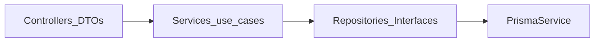

# Aerobi API — guia para agentes (IA)

Fonte canónica de contexto para qualquer modelo (Claude, Codex, Cursor, Copilot) a trabalhar neste repositório. Documenta apenas o que **não se deduz só pelo código**: produto, stack, convenções estáveis e onde procurar o resto.

## Produto

API **Aerobi** (NestJS): sincronização e consulta relacionadas com dados ANAC (ex. histórico RAB em CSV), aeródromos (públicos/privados, operacionais), proxies **Plugfield** e **AISWEB/DECEA**, consulta à ANAC para licença de piloto, pedidos de aterragem, visitas técnicas, tokens de e‑mail/password, etc.

Operação (`X-API-Key`, variáveis `PLUGFIELD_*`, `AISWEB_*`, Docker, cron RAB): ver [README.md](README.md).

## Stack canónica

- **Framework**: NestJS 11
- **Runtime**: Node 22 (CI em `ubuntu-latest`; ver `.github/workflows/ci.yml`)
- **Package manager**: npm (`package-lock.json` é fonte de verdade)
- **ORM / DB**: Prisma 7 (`@prisma/adapter-pg`) + PostgreSQL — schema em `prisma/schema.prisma`, cliente gerado sob `src/generated/prisma/` (via `postinstall` / `prisma generate`)
- **Validação / transformação**: class-validator + class-transformer nos DTOs de entrada quando aplicável (`ValidationPipe` global com `transform` + `whitelist` em `src/main.ts`)
- **Documentação HTTP**: Swagger em `/api/docs` (`@nestjs/swagger`)
- **Testes**: Jest — ficheiros `*.spec.ts` junto ao código (ou em `src/`)
- **CI/CD**: [`.github/workflows/ci.yml`](.github/workflows/ci.yml) (security audit, Quality: prisma generate + validate + `lint:check` + `format:check` + build, job Test com Postgres + migrates + test); [`.github/workflows/release.yml`](.github/workflows/release.yml) para `main` (semantic-release, imagem GHCR, deploy)
- **Path alias**: `@/*` → `src/*` (`tsconfig.json` / `jest`)

### Portas (desenvolvimento típico)

- API dev: **3333** (ver README / Docker Compose)

## Arquitectura e pastas

| Área | Papel |
|------|--------|
| `src/common/` | Guards (`AerobiApiKeyGuard`), filtros (`AllExceptionsFilter`), excepções (`CustomHttpException`), enumerados de erro (`ErrorCode`), mensagens (`ErrorMessageModule` / serviços), utilitários partilhados |
| `src/modules/<domínio>/` | Módulos de feature Nest (controllers, services, DTOs, repositórios, mappers, docs Swagger, cron quando aplicável) |
| `src/prisma/` | `PrismaModule` + `PrismaService` injectável |
| `src/app.module.ts` | Registo de todos os feature modules |

### Exemplos de referência por forma de módulo

- **CRUD HTTP alinhado com scaffold**: `src/modules/rab/`, `src/modules/public-aerodromes/` (estrutura com controllers/services/repositories/docs/mappers onde aplicável).
- **Integração / proxy**: `src/modules/plugfield/`, `src/modules/aisweb/`.
- **Sync / ingestão**: `src/modules/private-aerodromes/`.
- **Agendamento**: `src/modules/scheduler/`.

Pastas‑guia dentro de vários feature modules incluem `README.md` por camada (`controllers/`, `services/`, …).

## Baixo acoplamento e divisão de responsabilidades

- **Controller**: HTTP/Swagger + validação de I/O via DTOs; delega sempre que possível ao service.
- **Service**: caso de uso e orquestração; não “conhece” detalhes de framework além do que for necessário.
- **Repository** (+ interface onde existir): acesso ao Prisma; evitar duplicar queries espalhadas em vários services.
- **DTOs**: nos limites das rotas; **mappers** para projectar entidades/registos em resposta API onde o projeto usa esse padrão.
- Entre domínios: preferir **`imports` / `exports` de `Module`** e serviços públicos aos imports directos ao interior de outro módulo. Lógica partilhada transversal vai para `src/common/` ou um módulo dedicado exportado explicitamente.
- Evitar “serviço deus”; manter comandos/consultas coerentes dentro do respetivo módulo.

## Erros HTTP

Lançar **`CustomHttpException`** com **`ErrorCode`** estável (`src/common/enums/error-code.enum.ts`) e mensagens via **`ErrorMessageService.getMessage(...)`**. O **`AllExceptionsFilter`** garante payloads consistentes. Não regressar para strings hardcoded em `HttpException('...')` em fluxos novos.

## Autenticação do cliente para a Aerobi

Rotas sensíveis usam comunmente **`@UseGuards(AerobiApiKeyGuard)`** e header **`X-API-Key`** (= `AEROBI_API_KEY`). Em **`NODE_ENV=development`**, há bypass salvo quando **`AEROBI_REQUIRE_AUTH=true`**. Produção obriga API key onde o guard estiver aplicado. Detalhes: README + Swagger + JSDoc do guard.

## Novos recursos (checklist)

1. **Modelo de dados**: se precisar de persistência nova, actualizar `prisma/schema.prisma` e migrações; `prisma generate` em dev/CI.
2. **CRUD repetível**: seguir [`.claude/commands/scaffold-module.md`](.claude/commands/scaffold-module.md) e `node scripts/scaffold-module.mjs ...` (não duplicar a árvore neste ficheiro).
3. **Não‑CRUD** (proxy, sync, batch, cron): copiar padrão de módulos existentes (`plugfield/`, `rab/`, `private-aerodromes/`, `scheduler/`).
4. Registar o módulo em [`src/app.module.ts`](src/app.module.ts) (`imports`; manter ordenação já usada pelo repo).
5. Verificar antes de merge: **`npm run build`**, **`npm run lint:check`**, **`npm run format:check`**, **`npm run test`**.
6. Git/PR: workflow em [`.claude/commands/`](.claude/commands/) (espelhado em [`.cursor/commands/`](.cursor/commands/)); ver [`.github/BRANCH_PROTECTION.md`](.github/BRANCH_PROTECTION.md) se aplicável.

## Deploy (resumo)

Produção: imagem no GHCR, Docker Compose prod, rede **`warpgate`** partilhada com Postgres noutro stack (ver README e `docker-compose.prod.yml`). Não documentar valores secretos aqui.

## Tooling

- **Prettier**: `npm run format` / `npm run format:check` (`src/**/*.ts`)
- **ESLint**: `npm run lint` (com `--fix` local); **`npm run lint:check`** no CI (sem fix)
- Histórico e versões de release: **`CHANGELOG.md`**, **`semantic-release`**
