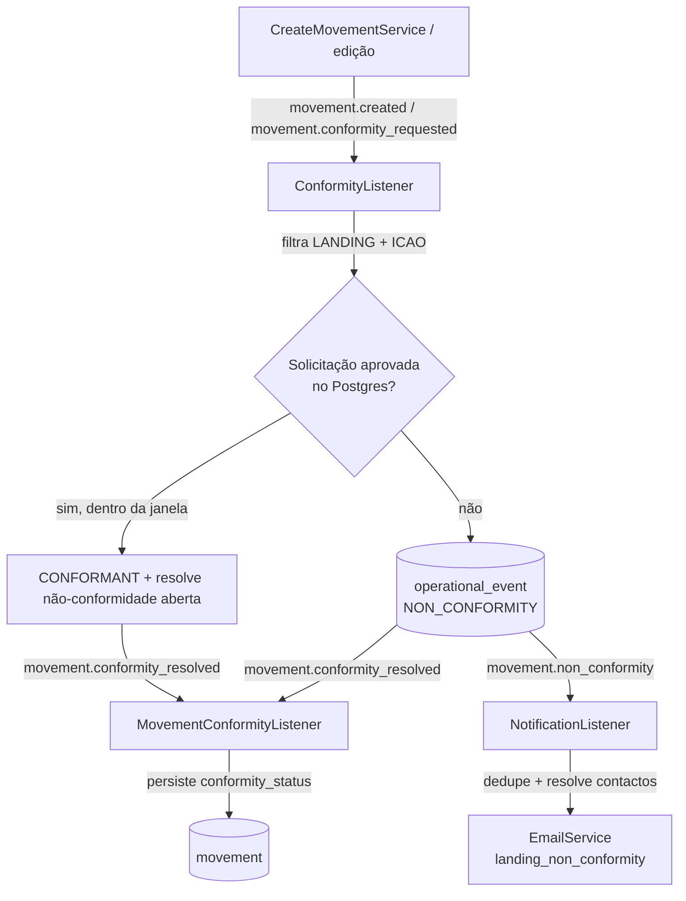

# Módulo `conformity`

**Conformidade operacional** entre **movimentos** (pousos) e **solicitações de
pouso**. A cada **pouso com aeródromo conhecido** (origem `AUTOMATIC` ou
`MANUAL`), o módulo verifica se existia uma **solicitação de pouso autorizada**
para aquela aeronave naquele aeródromo. Havendo, resolve o movimento como
**conforme** (`CONFORMANT`); não havendo, como **não conforme**
(`NON_CONFORMANT`), regista uma **não-conformidade** (`OperationalEvent`) e
**notifica** por e-mail os coordenadores/operadores do aeródromo. O resultado é
persistido em `Movement.conformityStatus` (módulo `movements`) via evento.

É relevante para o registro de movimentos e para a operação junto à **ANAC**:
sinaliza pousos que ocorreram sem a autorização prévia esperada, dando aos
responsáveis do aeródromo a oportunidade de verificar e tomar as providências de
conformidade cabíveis.

> **Decolagens** (`TAKEOFF`) e pousos **sem ICAO de aeródromo** não entram na
> regra (nascem `NOT_APPLICABLE`). Pousos **manuais** (`MANUAL`) **entram** na
> regra, tal como os automáticos.

## Fluxo

Tudo é **assíncrono e desacoplado** via `@nestjs/event-emitter`, e **resiliente**:
uma falha de leitura do diretório (Postgres) ou de e-mail é logada mas **não**
derruba a ingestão do movimento (os handlers capturam e não relançam — no MVP
não há retry).

| Evento | Emitido por | Consumido por |
|--------|-------------|---------------|
| `movement.created` | `CreateMovementService` (módulo `movements`) | `ConformityListener` |
| `movement.conformity_requested` | `UpdateMovementService` (reavaliação na edição de matrícula) | `ConformityListener` |
| `movement.conformity_resolved` | `ConformityListener` | `MovementConformityListener` (módulo `movements`) |
| `movement.non_conformity` | `ConformityListener` | `NotificationListener` |

Ficheiros:

| Elemento | Papel |
|----------|--------|
| `listeners/conformity.listener.ts` | Reage a `movement.created`/`movement.conformity_requested`; aplica a regra de matching; resolve a conformidade (`movement.conformity_resolved`), regista a não-conformidade (deduplicada) e emite `movement.non_conformity`. |
| `listeners/notification.listener.ts` | Reage a `movement.non_conformity`; faz dedupe, resolve destinatários e envia o e-mail. |
| `ports/directory.port.ts` | Contrato de leitura do diretório (matching + grupo + contactos). |
| `adapters/postgres-directory.adapter.ts` | Implementação Postgres do port (**único** ponto que conhece models/colunas Prisma). |
| `repositories/operational-event.repository.ts` | Acesso Prisma ao `operational_event` (criar, dedupe, marcar notificado). |
| `events/movement-non-conformity.event.ts` | Nome + payload do evento de não-conformidade. |
| `conformity.module.ts` | Liga o port ao adapter (token) e regista os listeners. |

## Regra de matching

O `ConformityListener` só processa o evento quando o movimento é **`LANDING` com
ICAO de aeródromo** (de qualquer origem — `AUTOMATIC` ou `MANUAL`). Caso
contrário, retorna sem efeito (o movimento já nasce `NOT_APPLICABLE`).

Procura no Postgres (`landing_requests`) uma solicitação de pouso que satisfaça
**todas** as condições:

- `aircraft_registration` == matrícula do movimento (comparação em maiúsculas);
- `icao` == ICAO do aeródromo do movimento (maiúsculas);
- `status` == `APPROVED`;
- `request_date` dentro de **±`CONFORMITY_MATCH_WINDOW_HOURS`** (default **24h**)
  em relação ao instante do pouso (`readingDatetime`);
- não eliminada (`deleted_at` nulo).

Havendo várias candidatas dentro da janela, escolhe a **mais próxima** do
instante do pouso. A verificação **apenas confirma a existência** de uma
solicitação aprovada — **não a "consome"** nem altera o seu estado. Sem match,
cria um `OperationalEvent` do tipo `NON_CONFORMITY_NO_LANDING_REQUEST` e emite
`movement.non_conformity`.

## Diretório atrás de um port

O diretório de leitura é exposto pelo **`DirectoryPort`** (token de injeção
`DIRECTORY_PORT`), implementado pelo **`PostgresDirectoryAdapter`**. Os
consumidores (listeners) dependem **apenas** do contrato; nenhum detalhe da
fonte de dados — models/colunas Prisma — vaza para fora do adapter.

O adapter lê 3 fontes já migradas para o Postgres:

| Model Prisma | Usado para | Campos relevantes |
|--------------|-----------|-------------------|
| `LandingRequest` | Matching da solicitação | `aircraftRegistration`, `icao`, `status` (`APPROVED`), `requestDate`, `deletedAt` |
| `Aerodrome` | ICAO → grupo | `icao`, `groupId`, `deletedAt` |
| `User` | Grupo → contactos | `groupId`, `role`, `email`, `name`, `phone`, `deletedAt` |

As `roles` chegam em minúsculas (`'coordinator'`/`'operator'`) e são mapeadas
para o enum `UserRole` (maiúsculo) no `where`.

A migração **Firestore → Postgres** do diretório foi concluída na **#475**
(trocando **apenas o adapter**, mantendo o port e os listeners intactos — plano
original em **#255**).

## Persistência

A não-conformidade vive na tabela **`operational_event`** (model
`OperationalEvent`, final de `prisma/schema.prisma`); a relação com o movimento é
por `movement_id` (opcional, `SetNull` para não perder o evento se o movimento
sumir). Além disso, o **resultado da avaliação** é persistido em
**`Movement.conformityStatus`** (`PENDING` → `CONFORMANT`/`NON_CONFORMANT`; ou
`NOT_APPLICABLE`), escrito pelo `MovementConformityListener` do módulo
`movements` ao reagir a `movement.conformity_resolved`.

| Campo | Papel |
|-------|--------|
| `type` | `OperationalEventType` — hoje só `NON_CONFORMITY_NO_LANDING_REQUEST`. |
| `status` | `OperationalEventStatus` — `OPEN` (default) / `ACKNOWLEDGED` / `RESOLVED`. |
| `aerodrome` | ICAO do aeródromo do evento. |
| `occurredAt` | Quando o pouso ocorreu (= `readingDatetime`). |
| `detectedAt` | Quando o sistema detectou (default `now()`). |
| `notifiedAt` | Quando a notificação foi enviada (`null` = ainda não notificado). |

## Notificação

O `NotificationListener` reage a `movement.non_conformity` e:

1. **Dedupe**: procura uma não-conformidade **já notificada** (`notifiedAt`) para
   a mesma **(matrícula, aeródromo)** dentro de
   **`CONFORMITY_NOTIFY_DEDUPE_MINUTES`** (default **30 min**). Se houver, ignora
   e não reenvia.
2. **Destinatários**: resolve, no Postgres, o `group_id` do aeródromo (por ICAO)
   e depois os utilizadores desse grupo (`group_id`) com role **`coordinator`**
   ou **`operator`** e com e-mail.
3. **E-mail**: envia o template `landing_non_conformity` para os contactos e marca
   a não-conformidade como notificada (`notifiedAt`).

Se não houver grupo, ou o grupo não tiver contactos, regista um log e termina sem
erro.

### Template de e-mail (`landing_non_conformity`)

Definido em `src/common/email/templates/index.ts`. Placeholders substituídos pelo
listener:

| Placeholder | Valor |
|-------------|-------|
| `[REGISTRATION]` | Matrícula da aeronave do movimento. |
| `[AERODROME]` | ICAO do aeródromo. |
| `[OCCURRED_AT]` | Instante do pouso (ISO 8601). |

## Configuração (env)

Ver `.env.example` (secção "Conformidade"). O diretório de leitura usa o Postgres
— **sem** credenciais Firebase (migrado na #475).

| Variável | Default | Papel |
|----------|---------|-------|
| `CONFORMITY_MATCH_WINDOW_HOURS` | `24` | Janela (horas) ±N para casar pouso × solicitação. |
| `CONFORMITY_NOTIFY_DEDUPE_MINUTES` | `30` | Janela (minutos) de dedupe das notificações. |

Ambas as janelas têm fallback ao default se a env for ausente, não-numérica ou
não-positiva.

## Limitações conhecidas (MVP)

- **Sem escape de HTML nos placeholders do e-mail**: o `EmailService` interpola os
  valores no template sem escapar HTML. É um comportamento **pré-existente** e
  hoje seguro (os inputs — matrícula, ICAO, data — são controlados); fica um
  hardening futuro.
- **Race no dedupe**: o dedupe lê o `operational_event` antes de enviar. Se dois
  listeners processarem o **mesmo** pouso em simultâneo, ambos podem passar pela
  verificação e enviar **dois** e-mails. Aceitável no MVP (volume baixo,
  consequência apenas um e-mail duplicado).

## Fora de escopo / futuro

- **Consulta/relatório** dos `operational_event` (listagem, dashboards,
  reconhecimento/resolução): epic futura.
- **Aprimoramento do matching** e estudo de **"consumir"** a solicitação (marcá-la
  como usada em vez de só checar existência).
